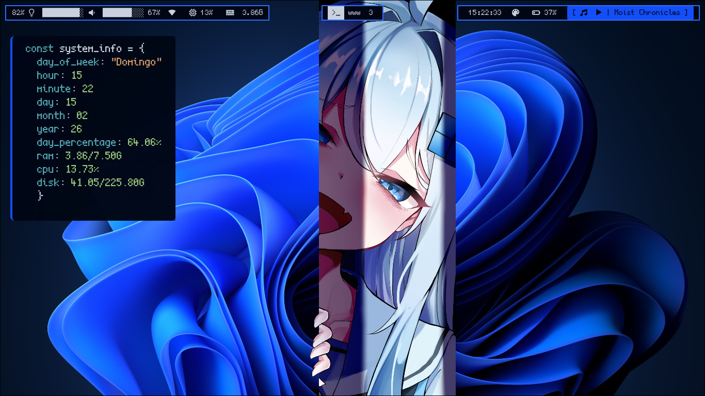
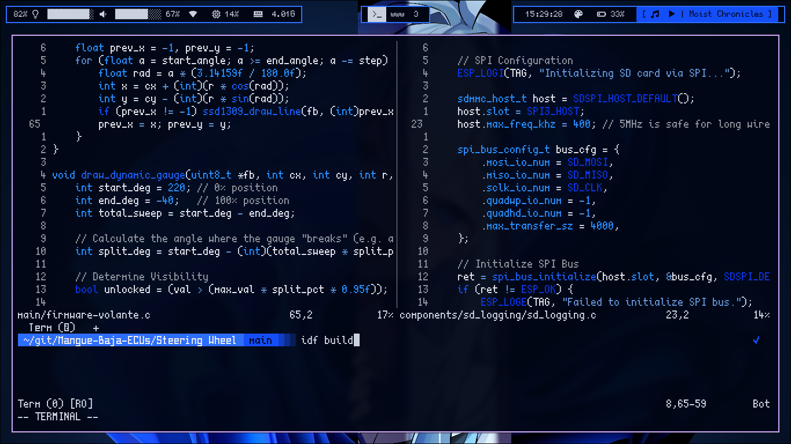
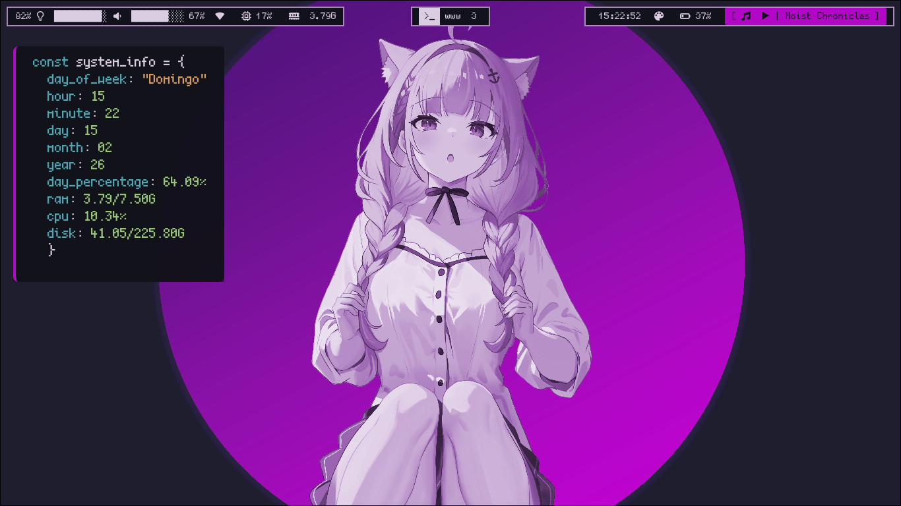
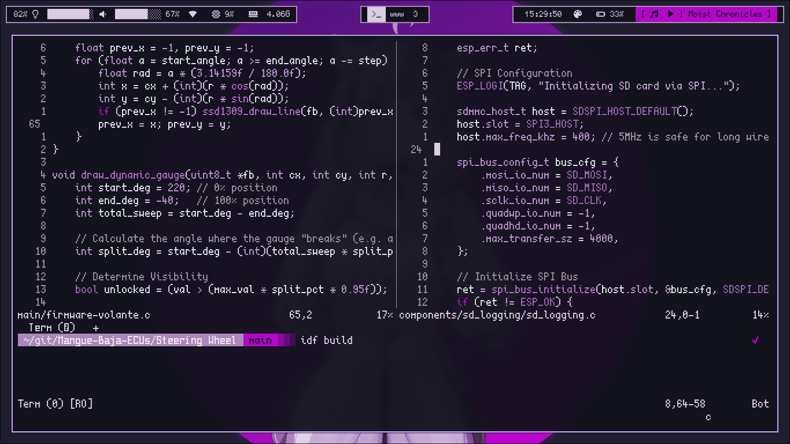

# My t480 dotfiles

Dotfiles for my laptop.

TODO:

- Eww 
    - Change "current_time" to "system_info"
        - Add time to next wallpaper.
        - Add everything that is on waybar. (3/7)
    - Still need to make notification widgets.
    - Find better way to organize infobox.

- Waybar

- Wallpaper
    - Create my own wallpapers.
    
- Neovim
    - !Add a new neovim config. | Done

- Hyprlock
    - Add hyprlock config with fingerprint reader.

## Extra credits

- [Diinki retrofuture rice (eww)](https://github.com/diinki/diinki-retrofuture/)
- [Catpuccin colorscheme](https://catppuccin.com/)
