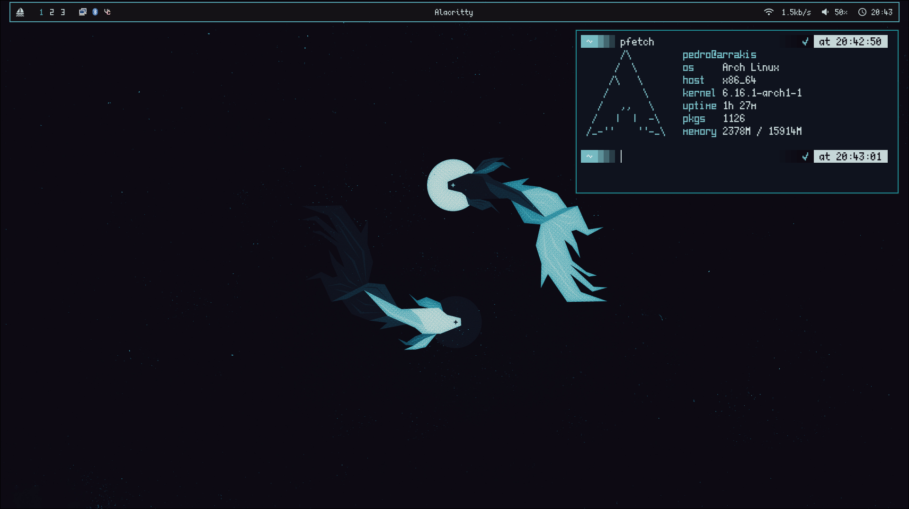

# My t480 dotfiles

Dotfiles for my laptop.

TODO:

- Widgets
    - Add eww or quickshell.
    - Notification widgets.
    - Add desktop panel if there are no windows open in current workspace.

- Waybar
    - Add progress bar to audio and battery. | Done

- Wallpaper
    - Create my own wallpapers.
    
- Neovim
    - !Add a new neovim config. | Done
    - Add neovim colorcode plugin. | Done
    - Add BetterTerm plugin. | Done

- Extra
    - !Edit hyprlock config file.
    - !Add fingerprint lock-screen script.
